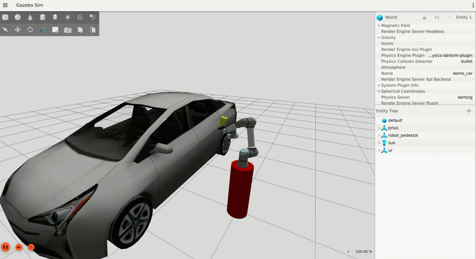

<!-- Improved compatibility of back to top link -->
<a id="readme-top"></a>

[![Contributors][contributors-shield]][contributors-url]
[![Forks][forks-shield]][forks-url]
[![Stargazers][stars-shield]][stars-url]
[![Issues][issues-shield]][issues-url]
[![Apache-2.0 License][license-shield]][license-url]
[![LinkedIn][linkedin-shield]][linkedin-url]


<!-- PROJECT LOGO -->
<br />
<div align="center">
  <a href="https://github.com/topguns837/gz_sim_spray_painting_plugin">
  </a>

<h3 align="center">Gz Sim Spray Painting Plugin</h3>

  <p align="center">
    A Gazebo Harmonic (gz-sim 8) system plugin that simulates spray paint application
    via physics ray-casting. Generates realistic cone coverage with paint patches on
    any surface geometry and a particle cloud visual effect.
    <br />    ·
    <a href="https://github.com/topguns837/gz_sim_spray_painting_plugin/issues/new?labels=bug&template=bug-report---.md">Report Bug</a>
    ·
    <a href="https://github.com/topguns837/gz_sim_spray_painting_plugin/issues/new?labels=enhancement&template=feature-request---.md">Request Feature</a>
  </p>
</div>


<!-- TABLE OF CONTENTS -->
<details>
  <summary>Table of Contents</summary>
  <ol>
    <li><a href="#about-the-project">About The Project</a>
      <ul><li><a href="#built-with">Built With</a></li></ul>
    </li>
    <li><a href="#getting-started">Getting Started</a>
      <ul>
        <li><a href="#prerequisites">Prerequisites</a></li>
        <li><a href="#installation">Installation</a></li>
      </ul>
    </li>
    <li><a href="#usage">Usage</a>
      <ul>
        <li><a href="#demo-worlds">Demo Worlds</a></li>
        <li><a href="#spray-trigger">Spray Trigger</a></li>
        <li><a href="#plugin-sdf-parameters">Plugin SDF Parameters</a></li>
        <li><a href="#integrating-into-your-own-robot">Integrating into Your Own Robot</a></li>
      </ul>
    </li>
    <li><a href="#roadmap">Roadmap</a></li>
    <li><a href="#contributing">Contributing</a></li>
    <li><a href="#license">License</a></li>
    <li><a href="#contact">Contact</a></li>
    <li><a href="#acknowledgments">Acknowledgments</a></li>
  </ol>
</details>


<!-- ABOUT THE PROJECT -->
## About The Project



The **GZ Sim Spray Painting Plugin** (`libSprayPaintPlugin.so`) is a Gazebo Harmonic
system plugin that turns any simulated link into a spray gun nozzle. It fires a
configurable ray-casting cone each simulation step and deposits thin disc paint patches
wherever rays intersect geometry. A dynamic particle emitter provides the visual spray
cloud and follows the nozzle in real time.

<p align="right">(<a href="#readme-top">back to top</a>)</p>


### Built With

[![ROS 2 Humble][ROS2-badge]][ROS2-url]
[![Gazebo Harmonic][GZ-badge]][GZ-url]
[![C++17][CPP-badge]][CPP-url]
[![Python3][Python-badge]][Python-url]
[![Docker][Docker-badge]][Docker-url]
[![MoveIt2][MoveIt-badge]][MoveIt-url]

<p align="right">(<a href="#readme-top">back to top</a>)</p>


<!-- GETTING STARTED -->
## Getting Started

### Prerequisites

- **Docker** (tested with Docker Engine 24.x on Ubuntu 22.04)

No local ROS 2 or Gazebo installation is required.

### Installation

1. Clone the repository
   ```sh
   git clone https://github.com/topguns837/gz_sim_spray_painting_plugin.git
   cd gz_sim_spray_painting_plugin
   ```

2. Make the start script executable and launch it
   ```sh
   chmod +x startScript.sh
   ./startScript.sh
   ```
   [`startScript.sh`](startScript.sh) is the single entrypoint for all operations.
   It delegates to [`run_scripts/build_code.py`](run_scripts/build_code.py) for code
   builds and [`run_scripts/docker/run_docker.sh`](run_scripts/docker/run_docker.sh)
   for container management. It presents an interactive menu:

   | Option | Action |
   |--------|--------|
   | **[1] Start Stack** | Launch the simulation (see [Usage](#usage)) |
   | **[2] Code Build** | Run `colcon build` inside Docker after source changes |
   | **[3] Docker Build** | Build the [`Dockerfile`](Dockerfile) (one-time, ~10-15 min) |
   | **[4] Empty Container** | Open an interactive shell inside the container |

   On first setup, run **option 3** (Docker Build) followed by **option 2** (Code Build).

<p align="right">(<a href="#readme-top">back to top</a>)</p>


<!-- USAGE EXAMPLES -->
## Usage

### Launching the demo

```sh
./startScript.sh
```

Select **[1] Start Stack** from the menu. This starts the Docker container, sets up
X11 forwarding, GPU passthrough, and volume mounts, then presents a world-selection
menu. The launcher creates a `tmux` session with separate windows for the simulator,
the spray controller, and (in UR mode) the Cartesian path executor.

---

### Demo Worlds

| World stem | Mode | SDF file | Description |
|------------|------|----------|-------------|
| `demo_car` | UR mode | [`demo_car.sdf`](src/gz_spray_painting_plugin_demo/worlds/demo_car.sdf) | Full UR5e arm + MoveIt 2 + Prius car model (autonomous spray demo) |
| `demo_cube` | Demo mode | [`demo_cube.sdf`](src/gz_spray_painting_plugin_demo/worlds/demo_cube.sdf) | Simple box target - fast to load, good for plugin verification |
| `demo_cylinder` | Demo mode | [`demo_cylinder.sdf`](src/gz_spray_painting_plugin_demo/worlds/demo_cylinder.sdf) | Cylindrical target |
| `demo_ellipsoid` | Demo mode | [`demo_ellipsoid.sdf`](src/gz_spray_painting_plugin_demo/worlds/demo_ellipsoid.sdf) | Ellipsoidal target |

*UR mode* launches a three-window tmux layout: Gazebo + MoveIt 2, the Cartesian spray
executor (auto-starts 20 s after launch), and a spray control pane with pre-typed ON/OFF
commands. *Demo mode* launches Gazebo with a standalone nozzle and a spray control pane.

---

### Spray Trigger

The `tmux` session created by the start script includes a dedicated `spray_control`
window with the ON and OFF commands pre-typed and ready to send.

Switch to the spray control window with:

| Mode | Key sequence |
|------|-------------|
| UR mode (`demo_car`) | `Ctrl+B` then `2` |
| Demo mode (all others) | `Ctrl+B` then `1` |

The window has two panes : Top pane sends **Spray ON**, bottom pane sends **Spray OFF**.
Press **Enter** in the relevant pane to toggle spray painting.

The topic name is configurable via the `<spray_topic>` SDF parameter (defined in
[`src/gz_sim_spray_painting_plugin/include/gz_sim_spray_painting_plugin/SprayPaintPlugin.hh`](src/gz_sim_spray_painting_plugin/include/gz_sim_spray_painting_plugin/SprayPaintPlugin.hh)).

---

### Plugin SDF Parameters

All parameters are optional; the defaults listed below apply when omitted.

| Parameter | Type | Default | Description |
|-----------|------|---------|-------------|
| `nozzle_link` | string | `spray_gun_nozzle_link` | Link whose +X axis is the spray direction |
| `cone_half_angle_deg` | double | `15` | Half-angle of the spray cone (degrees) |
| `cone_max_range` | double | `1.0` | Maximum spray reach (metres) |
| `spray_color` | Color | `1.0 0.2 0.1 1.0` | RGBA paint colour applied to patches and particles |
| `spray_topic` | string | `/spray_paint/trigger` | `gz.msgs.Boolean` topic to arm / disarm spray |
| `particle_rate` | double | `100` | Particle cloud density (particles / second) |
| `num_rays` | int | `16` | Number of rays sampled across the cone each scan interval |
| `patch_spacing` | double | `0.02` | Minimum centre-to-centre distance between patches (metres) |
| `paint_interval_steps` | int | `10` | Perform a ray scan every N simulation steps |
| `enable_particle_emitter` | bool | `true` | Set to `false` to disable the particle cloud (ray-cast painting still works) |

---

### Integrating into Your Own Robot

Add the plugin to any link in your URDF or SDF. See
[`src/gz_spray_painting_plugin_demo/urdf/spray_nozzle.urdf`](src/gz_spray_painting_plugin_demo/urdf/spray_nozzle.urdf)
for a standalone nozzle example and
[`src/gz_spray_painting_plugin_demo/urdf/ur_spray_gz.urdf.xacro`](src/gz_spray_painting_plugin_demo/urdf/ur_spray_gz.urdf.xacro)
for the UR5e arm integration.

```xml
<plugin filename="libSprayPaintPlugin.so"
        name="gz::sim::systems::SprayPaintPlugin">
  <!-- Required: link whose +X axis points in the spray direction -->
  <nozzle_link>my_nozzle_link</nozzle_link>

  <!-- Optional overrides -->
  <cone_half_angle_deg>20</cone_half_angle_deg>
  <cone_max_range>1.5</cone_max_range>
  <spray_color>0.1 0.5 1.0 1.0</spray_color>
  <spray_topic>/my_robot/spray</spray_topic>
  <particle_rate>150</particle_rate>
  <num_rays>24</num_rays>
  <patch_spacing>0.015</patch_spacing>
  <paint_interval_steps>5</paint_interval_steps>
</plugin>
```

Make the shared library discoverable by setting `GZ_SIM_SYSTEM_PLUGIN_PATH` to the
directory containing `libSprayPaintPlugin.so` before launching Gazebo.

```sh
export GZ_SIM_SYSTEM_PLUGIN_PATH=/path/to/install/gz_sim_spray_painting_plugin/lib/gz_sim_spray_painting_plugin:$GZ_SIM_SYSTEM_PLUGIN_PATH
```

<p align="right">(<a href="#readme-top">back to top</a>)</p>


<!-- LICENSE -->
## License

Distributed under the Apache-2.0 License. See [`LICENSE.txt`](LICENSE.txt) for more information.

<p align="right">(<a href="#readme-top">back to top</a>)</p>


<!-- CONTACT -->
## Contact

Arjun Kharidas - kharjun4@gmail.com

Project Link: [https://github.com/topguns837/gz_sim_spray_painting_plugin](https://github.com/topguns837/gz_sim_spray_painting_plugin)

<p align="right">(<a href="#readme-top">back to top</a>)</p>


<!-- ACKNOWLEDGMENTS -->
## Acknowledgments

* [Gazebo Harmonic Documentation](https://gazebosim.org/docs/harmonic)
* [ROS 2 Humble Documentation](https://docs.ros.org/en/humble/)
* [Universal Robots ROS2 Driver](https://github.com/UniversalRobots/Universal_Robots_ROS2_Driver)

<p align="right">(<a href="#readme-top">back to top</a>)</p>


<!-- MARKDOWN LINKS & IMAGES -->
[contributors-shield]: https://img.shields.io/github/contributors/topguns837/gz_sim_spray_painting_plugin.svg?style=for-the-badge
[contributors-url]: https://github.com/topguns837/gz_sim_spray_painting_plugin/graphs/contributors
[forks-shield]: https://img.shields.io/github/forks/topguns837/gz_sim_spray_painting_plugin.svg?style=for-the-badge
[forks-url]: https://github.com/topguns837/gz_sim_spray_painting_plugin/network/members
[stars-shield]: https://img.shields.io/github/stars/topguns837/gz_sim_spray_painting_plugin.svg?style=for-the-badge
[stars-url]: https://github.com/topguns837/gz_sim_spray_painting_plugin/stargazers
[issues-shield]: https://img.shields.io/github/issues/topguns837/gz_sim_spray_painting_plugin.svg?style=for-the-badge
[issues-url]: https://github.com/topguns837/gz_sim_spray_painting_plugin/issues
[license-shield]: https://img.shields.io/github/license/topguns837/gz_sim_spray_painting_plugin.svg?style=for-the-badge
[license-url]: https://github.com/topguns837/gz_sim_spray_painting_plugin/blob/master/LICENSE.txt
[linkedin-shield]: https://img.shields.io/badge/-LinkedIn-black.svg?style=for-the-badge&logo=linkedin&colorB=555
[linkedin-url]: https://linkedin.com/in/arjunkharidas
[product-screenshot]: images/screenshot.png

[ROS2-badge]: https://img.shields.io/badge/ROS2%20Humble-22314E?style=for-the-badge&logo=ros&logoColor=white
[ROS2-url]: https://docs.ros.org/en/humble/
[GZ-badge]: https://img.shields.io/badge/Gazebo%20Harmonic-FF7300?style=for-the-badge&logoColor=white
[GZ-url]: https://gazebosim.org/docs/harmonic
[CPP-badge]: https://img.shields.io/badge/C%2B%2B17-00599C?style=for-the-badge&logo=c%2B%2B&logoColor=white
[CPP-url]: https://en.cppreference.com/w/cpp/17
[Python-badge]: https://img.shields.io/badge/Python3-3776AB?style=for-the-badge&logo=python&logoColor=white
[Python-url]: https://www.python.org/
[Docker-badge]: https://img.shields.io/badge/Docker-2496ED?style=for-the-badge&logo=docker&logoColor=white
[Docker-url]: https://www.docker.com/
[MoveIt-badge]: https://img.shields.io/badge/MoveIt2-F7901E?style=for-the-badge&logoColor=white
[MoveIt-url]: https://moveit.picknik.ai/
